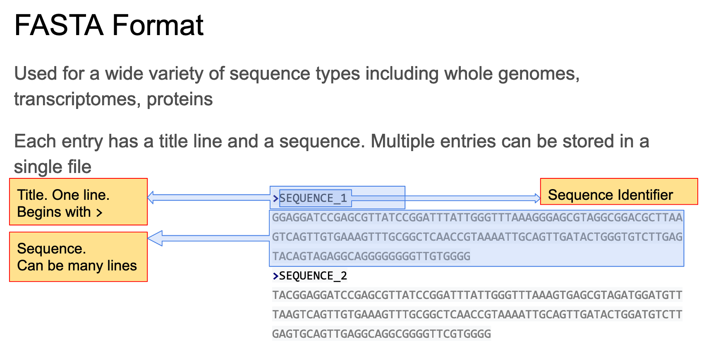
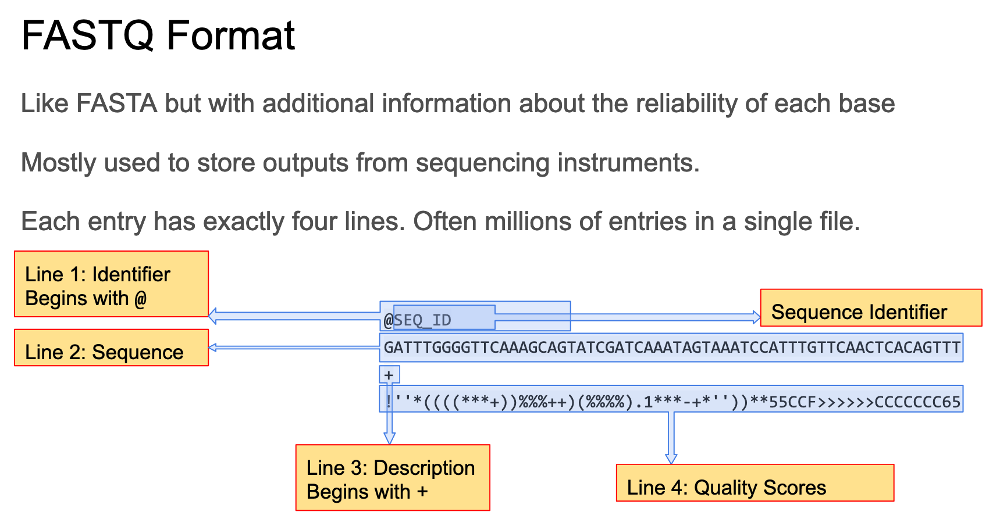

```{r setup, include=FALSE}
knitr::opts_chunk$set(echo = TRUE)
```

```{r connect to GitHub, include=FALSE}
# Enter in the R terminal window:

# git config --global user.email "you@example.com"
# git config --global user.name "Your Name"

# ***** Connected to GitHub using a SSH key. *****
```

Workshop instructions: <https://mb5370.bioinformatics.guide/2026/workshop1/workshop_1.html>

## Command Line Basics

In **Terminal**, the code language is referred to as *unix*. (***Unix code can only be entered into the R terminal. It will not work in the console!***)

There are many command options available:

-   `ls` - list directory contents
-   `cd` - change working directory
-   `pwd` - print working directory
-   `mkdir` - make a new directory
-   `cat`

To read about a unix command, type `man` before the command name.

```{bash man, eval=FALSE}
man grep
man cd
```

```{bash basic unix commands, eval=FALSE}
# List files in current directory
ls -l

# List files in reverse order
ls -lr

# View current working directory
pwd

# Make a new directory
mkdir command_line

# Change directory
cd ~
cd command_line
```

```{bash mock fasta, eval=FALSE}
# Create a mock fasta
cd ~/command_line
echo $'>fasta_header\nMMGTSRCVILLFALLLWAANAAPPEIHTTRPNVPEEIKRPNSTEIETPAVKQLETPSIFL\nLTTLEVAEADVDSTLETMKDRNKKNSAKLSKIGNNMKSLLSVFSVFGGFLSLLSVVTTTS' > test.fasta

# Look at the file
cat test.fasta
```

With large files, you can use the `head` bash command to view only the first few lines. By default `head` shows the first 10 lines.

```{bash head, eval=FALSE}
# View the first 2 lines
head -2 test.fasta
```

You can search for specific strings in files with the `grep` bash command.

```{bash grep, eval=FALSE}
# Find the header
grep `^>` test.fasta

# Find a specific amino acid sequence
grep LETMKDRNKK test.fasta
```

## Sequence File Formats

There are 2 common formats for storing sequence information.

| FASTA | FASTQ |
|---|---|
| Used for reference data | Used for "raw" reads from next generation sequencing experiments |
| Nucleotide & protein data | Includes quality scores from every base |

### FASTA Format

1+ entries, each with a header and sequence.

* Used with many different sequence types including whole genomes, transcriptomes, proteins
* Each entry has a title line & sequence. Multiple entries can be stored in a single file.

```{r fasta_fig, echo=FALSE, out.width="90%"}

```

### FASTQ Format

Designed for storing sequencing data along with quality scores. Standard formatting for many types of sequencing (e.g. Illumina short reads, Nanopore or PacBio longer reads). More information: https://en.wikipedia.org/wiki/FASTQ_format.

```{r fastq_fig, echo=FALSE, out.width="90%"}

```