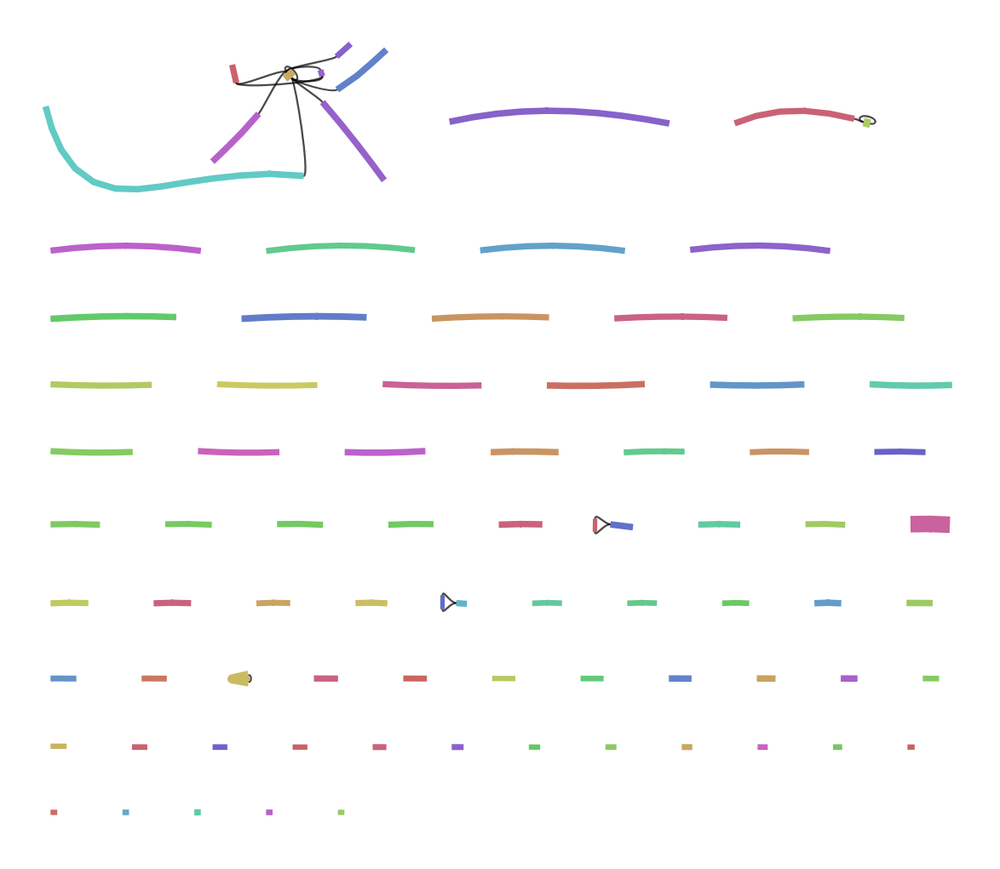
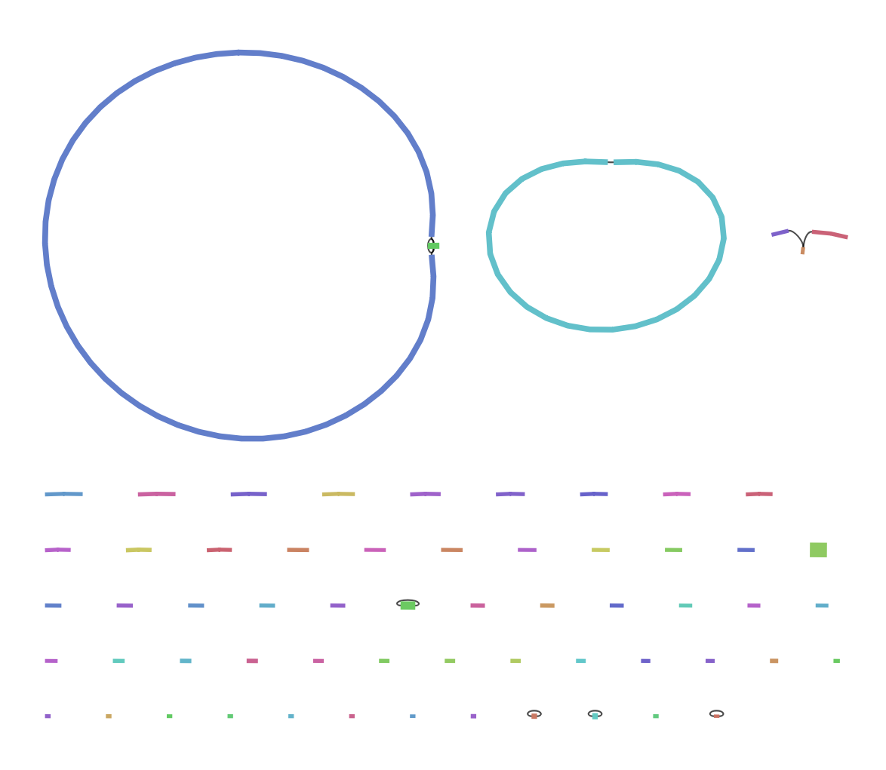

```{r setup, include=FALSE}
knitr::opts_chunk$set(echo = TRUE)
```

------------------------------------------------------------------------

***All code below is unix format. Enter into R terminal only!***

------------------------------------------------------------------------

## Redbean Assembly

```{bash setup redbean, eval=FALSE}
# Prepare a directory for running the software
mkdir redbean
cd redbean

# Collect a small subset of data for initial assembly
cat /pvol/data/amtp4/*_[012].fastq > amtp4.fastq
# first 3 lines: 12000 reads, 6x coverage of the target genome (not nearly enough to generate a good assembly!)

# Run the assembly
wtdbg2 -x ont -g 5m -t 4 -i amtp4.fastq -fo amtp4 
wtpoa-cns -t 4 -i amtp4.ctg.lay.gz -fo amtp4.ctg.fa

# Inspect assembly statistics
assembly-stats amtp4.ctg.fa
```

### Assembly Stats

In our assembly stats, N50 has the highest value, which tells us that a
larger portion of the genome is assembled into long, contiguous pieces.
This is representative of a good genome assembly!

-   sum = assembly length
-   n = \# of contigs
-   ave = average contig length
-   largest = largest contig length

| sum = 3639649, n = 120, ave = 30330.41, largest = 143809
| N50 = 48273, n = 23
| N60 = 36829, n = 32
| N70 = 28879, n = 43
| N80 = 22438, n = 57
| N90 = 13359, n = 79
| N100 = 2697, n = 120
| N_count = 0
| Gaps = 0

Now we'll run `redbean` again, bith with higher coverage

```{bash run redbean, eval=FALSE}
cat /pvol/data/amtp4/*.fastq > amtp4_20x.fastq
wtdbg2 -x ont -g 5m -t 4 -i amtp4_20x.fastq -fo amtp4_20x
wtpoa-cns -t 4 -i amtp4_20x.ctg.lay.gz -fo amtp4_20x.ctg.fa

# Inspect assembly statistics
assembly-stats amtp4_20x.ctg.fa
```

| stats for amtp4_20x.ctg.fa
| sum = 6878935, n = 89, ave = 77291.40, largest = 3344241
| N50 = 1764933, n = 2
| N60 = 1764933, n = 2
| N70 = 1764933, n = 2
| N80 = 54424, n = 8
| N90 = 23748, n = 28
| N100 = 4477, n = 89
| N_count = 0
| Gaps = 0

## Flye Assembly

Need to set up a working directory where we will store outputs and run
commands.

```{bash setup flye, eval=FALSE}
pwd

# Move up a directory
cd ...

mkdir flye
cd flyr
```

We need to link to the data we used for redbean.

```{bash link to redbean data, eval=FALSE}
ln -s ../redbean/amtp4.fastq .
ln -s ../redbean/amtp4_20x.fastq .
```

We will run `flye` using the queuing system slurm. Created a new shell
script file, "run_flye_small.sh", and saved it in the flye directory.

```{bash small shell script, eval=FALSE, include=FALSE}
#!/bin/bash
#SBATCH --time=60
#SBATCH --ntasks=4 --mem=4gb

echo "Starting flye in $(pwd) at $(date)"

flye --nano-raw amtp4.fastq --out-dir amtp4 --genome-size 5m --threads 4

echo "Finished flye in $(pwd) at $(date)"
```

```{bash run flye small, eval=FALSE}
sbatch run_flye_small.sh
# IMPORTANT: only run this command once so you don't end up with multiple conflicting runs of flye trying to overwrite one another

# Check job status
squeue
```

New file in `flye` directory: "slurm-343.out".

```{bash investigate slurm file, eval=FALSE}
tail slurm-343.out

# To follow the flye command as it's running:
tail -f slurm-343.out
```

Now we will make a new shell script file, "run_flye_large.sh", and save
it to our `flye` directory.

```{bash large shell script, eval=FALSE}
sbatch run_flye_large.sh
```

New file in `flye` directory: "slurm-348.out".

### Investigate flye output

```{bash flye output stats, eval=FALSE}
assembly-stats amtp4/assembly.fasta
```

## Inspect assembly graphs with Bandage

### Inspect low coverage flye assembly

Export the file "assembly-graph.gfa" from the `amtp4/flye` file
directory.

Open bandage and use the `File->Load Graph` menu to load the file
"assembly-graph.gfa". Then click `Draw Graph`.

```{r low-cov_fig, echo=FALSE, out.width="90%"}

```

*In this visualisation contiguous segments are shown as solid coloured
lines. Some of these are separated into independent graphs whereas
others (e.g. the mess in the top left corner) are connected to each
other via black lines. There are few things to keep in mind here;*

1.  *Biologically distinct entities such as chromosomes or plasmids will
    form separate graphs*
2.  *Separated graphs can also occur if coverage is very low and no
    reads exist to join parts of the assembly together*
3.  *Highly joined regions (eg top left) tend to occur because repeats
    create ambiguities. There are too many connections and the assembler
    has trouble choosing the correct path between them.*

**Observations from the graph:**

-   There don't appear to be any chromosomes in this graph - depth is
    too low (1-7x).
-   In the top left corner, amongst the contigs that are joined
    together, the brown one in the middle is likely a repeat as it has a
    depth of **42x** but is only 5,080 bp (base pairs) long.
-   There appears to be another potential repeat in the graph: the thick
    pink contig on the right end of the 6th row down. It has a depth of
    **122x** but is only 47,735 bp long!

### Inspect high coverage flye assembly

Repeat this process with the "assembly-graph.gfa" file from the
`amtp4_20x/flye` file directory.

```{r high-cov_fig, echo=FALSE, out.width="90%"}

```

**Observations from the graph:**

-   There are 2 nodes that connect to themselves at the top of the
    graph. The largest one is 3,367,286 bp and has a depth of 24x. The
    smaller one is 1,775,300 bp and has a depth of 23x.
-   There is a small node (5,655 bp) connected to itself and the largest
    node with a depth of 207x! I wonder if this is a plasmid with a lot
    of repeats.
-   In the top right corner there are 3 nodes connected to one another.
    Based on their small depth (3-5x) I don't think they are
    chromosomes.
-   There are lots of plasmids in the graph.

## Check Assembly Quality with QUAST

While we could clearly see a huge improvement above in contiguity with
the addition of more reads, we could not easily check for the accuracy
of assemblies.

Here we have a reference assembly which was previously created using
very deep coverage and best-practice genome polishing tools. By
comparing our assemblies to the reference we can assess them in terms of
all the important metrics, contiguity, completeness and correctness.

### Setup a Quast working directory

```{bash create quast dir}
# Move to the directory above flye
pwd
cd ..

# Make a new directory
mkdir quast
cd quast
```

### Prepare assembly data

```{bash}
mkdir flye_asm redbean_asm
```

Our reference assembly only contains contigs for the two major Vibrio
chromosomes. For our two deeper coverage assemblies this will correspond
to the two largest contigs. We extract these (and ignore all others) in
order to make the assembly comparison easier to interpret.

```{bash}
# Look at contig sizes in the flye assembly:
cat ../flye/amtp4_20x/assembly.fasta | bioawk -c fastx '{print $name, length($seq)}' | sort -n -k2

# Use samtools to extract 2 largest contigs:
samtools faidx ../flye/amtp4_20x/assembly.fasta contig_58 contig_10 > flye_asm/vibrio.fasta
```

Repeat for redbean assembly.

```{bash}
cat ../redbean/amtp4_20x.ctg.fa | bioawk -c fastx '{print $name, length($seq)}' | sort -n -k2
samtools faidx ../redbean/amtp4_20x.ctg.fa ctg1 ctg2 > redbean_asm/vibrio.fasta
```

```{bash}
# Create a symbolic link to the original reads
ln ../flye/amtp4_20x.fastq .

# Create a symbolic link to the reference assembly
ln -s /pvol/data/amtp4/reference/vibrio .
```

### Run QUAST

```{bash}
quast -o quast_vibrio redbean_asm/vibrio.fasta flye_asm/vibrio.fasta -L -t 4 --circos --glimmer -r vibrio/vibrio.fna --features  vibrio/vibrio.gff --nanopore amtp4_20x.fastq
```

This output is saved to the folder `quast_vibrio`. Look at the main
report (`report.html`) and a circos plot (`circos/circos.png`).

*Both assemblers seem to have done a very good job of assembling the genome but both have produced regions where there are a large number of small differences (snps and indels) between the assembly and the reference. The redbean assembly also seems to have a couple of gaps which most likely correspond with the highly repetitive region we observed in the Bandage visualisation.*

## Mystery Repeat Region

The 'flye' assembly contains a repeat region (contig 60) that could not be completely resolved.

```{bash}
# Create a new directory to store results in
mkdir ../repeat
cd ../repeat
```

